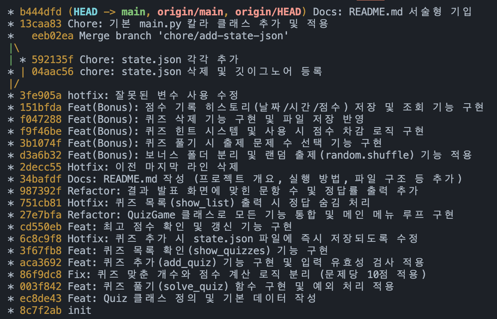
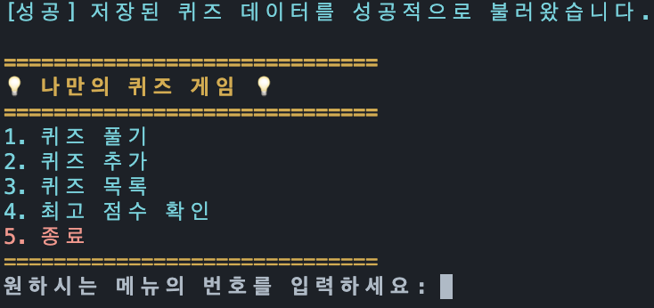
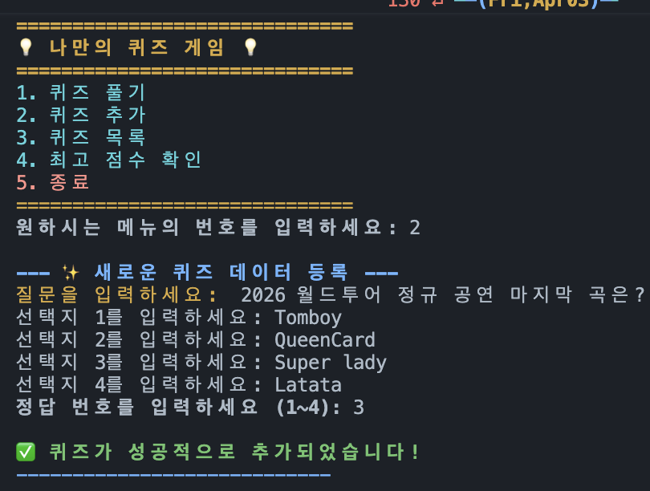
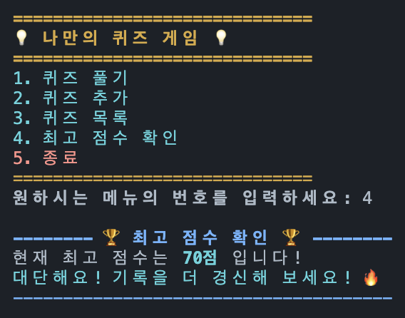
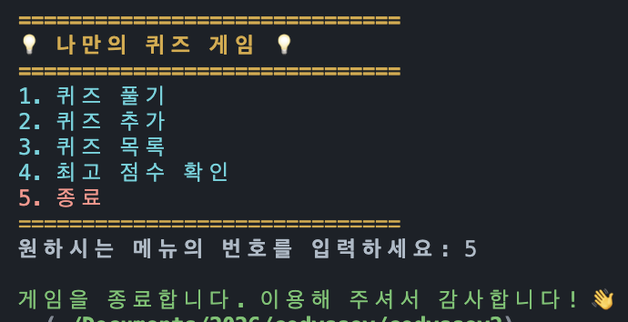
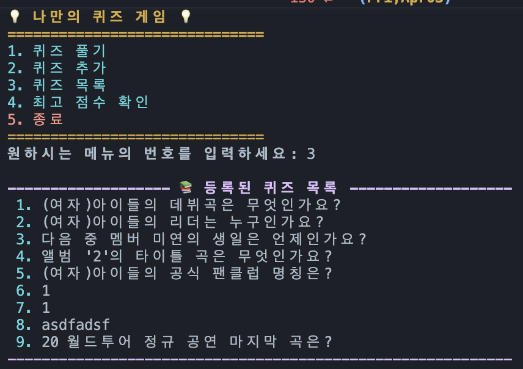
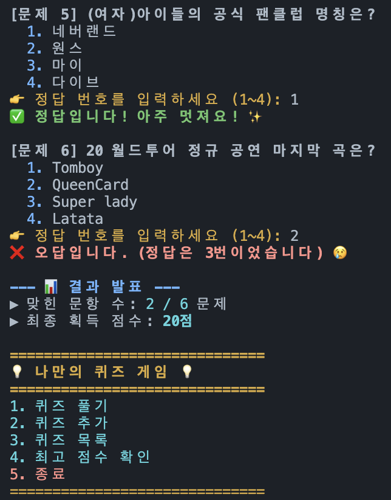
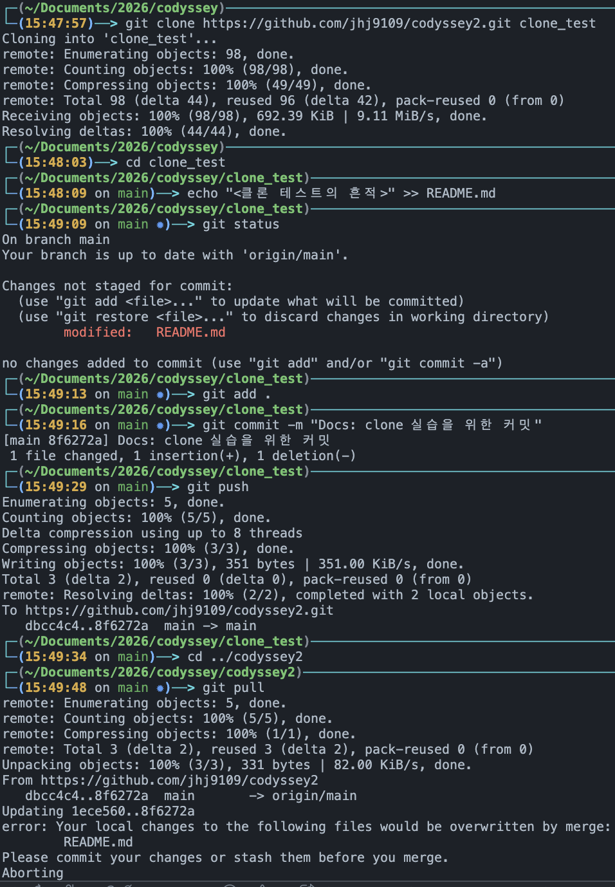
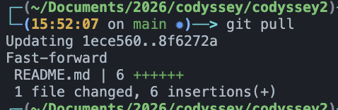

# 💡 나만의 콘솔 퀴즈 게임 (Python Quiz Game)

## 📌 프로젝트 개요
Python 기본 문법과 객체 지향 프로그래밍(OOP) 개념을 적용하여 만든 터미널 기반의 퀴즈 게임입니다. 
사용자가 직접 퀴즈를 풀고, 새로운 문제를 추가하며, 최고 점수를 관리할 수 있습니다. `json` 모듈을 활용한 데이터 영속성(Persistence)을 구현하여 프로그램을 종료해도 데이터가 유지되며, Git을 통한 버전 관리와 브랜치 전략을 실습한 프로젝트입니다.

## 🎵 퀴즈 주제 선정 이유
이번 퀴즈 게임의 주제는 **'(여자)아이들((G)I-DLE)'**입니다.
단순히 테스트용 더미 데이터가 아닌, 평소 즐겨듣고 관심 있는 K-Pop 아티스트를 주제로 선정하여 개발 과정의 흥미를 높이고자 했습니다. 멤버들의 정보나 타이틀곡 등 실질적인 팬심을 담아 기본 문제를 구성했습니다.

```python
initial_quizzes = [
    Quiz("(여자)아이들의 데뷔곡은 무엇인가요?", ["LATATA", "한(HANN)", "Senorita", "덤디덤디"], 1),
    Quiz("(여자)아이들의 리더는 누구인가요?", ["미연", "민니", "소연", "우기"], 3),
    Quiz("다음 중 멤버 미연의 생일은 언제인가요?", ["1월 21일", "1월 31일", "2월 14일", "3월 9일"], 2),
    Quiz("앨범 '2'의 타이틀 곡은 무엇인가요?", ["Queencard", "TOMBOY", "Nxde", "Super Lady"], 4),
    Quiz("(여자)아이들의 공식 팬클럽 명칭은?", ["네버랜드", "원스", "마이", "다이브"], 1)
]
```

## 🚀 실행 방법
이 프로그램은 Python 3.10 이상 환경에서 외부 라이브러리 없이 실행 가능합니다.

1. 터미널(또는 명령 프롬프트)을 열고 프로젝트 폴더로 이동합니다.
2. 아래 명령어를 입력하여 게임을 실행합니다.
   ```bash
   python main.py # (Mac/Linux 환경 등에서는 python3 main.py 로 실행)
   ```
## 🎯 기능 목록
1. 퀴즈 풀기: 저장된 퀴즈를 순차적으로 풀며, 공백 및 문자 입력 예외 처리가 적용되어 있습니다. 문제당 10점으로 계산됩니다.
2. 퀴즈 추가: 사용자가 직접 문제, 선택지(4개), 정답을 입력하여 새로운 퀴즈를 추가합니다.
3. 퀴즈 목록: 현재 등록된 모든 퀴즈의 질문과 정답을 한눈에 확인합니다.
4. 최고 점수 확인: 역대 퀴즈 플레이 중 가장 높았던 점수를 확인합니다.
5. 안전한 종료 및 자동 저장: 강제 종료(Ctrl+C)나 정상 종료 시 예외 처리와 함께 데이터가 안전하게 저장됩니다.

📁 파일 구조
```
📦 quiz-game-project
 ┣ 📜 main.py          # 게임 실행을 위한 메인 소스 코드 (Quiz, QuizGame 클래스)
 ┣ 📜 state.json       # 퀴즈 목록과 최고 점수가 저장되는 데이터 파일
 ┣ 📜 README.md        # 프로젝트 설명 문서
 ┗ 📂 docs
   ┗ 📂 screenshots    # 제출용 실행 결과 스크린샷 폴더
```

💾 데이터 파일 설명 (state.json)
프로그램의 상태를 저장하는 파일로 프로젝트 루트 디렉토리에 위치하며, UTF-8 인코딩을 사용합니다.
파일이 없거나 손상되었을 경우 프로그램 내장 기본 데이터로 안전하게 복구(fallback)됩니다.
- 경로: ./state.json
- 필드 구조 (Schema):
    - quizzes: (List) 각 퀴즈 객체의 정보를 담은 딕셔너리 리스트
        - question: (String) 질문 내용
        - choices: (List) 4개의 선택지 (문자열 리스트)
        - answer: (Integer) 정답 번호 (1~4)
    - best_score: (Integer) 현재까지 획득한 최고 점수

```json
{
    "quizzes": [
        {
            "question": "(여자)아이들의 데뷔곡은 무엇인가요?",
            "choices": ["LATATA", "한(HANN)", "Senorita", "덤디덤디"],
            "answer": 1
        }
    ],
    "best_score": 30
}
```

## github 저장소 url
https://github.com/jhj9109/codyssey2.git

## 개발환경
```bash
$ $code --version                                                                                                                                         127 ↵ ──(Fri,Apr03)─┘
1.111.0
ce099c1ed25d9eb3076c11e4a280f3eb52b4fbeb
arm64

$ python3 --version                                                                                                                                      127 ↵ ──(Fri,Apr03)─┘
Python 3.9.6
```
```
credential.helper=osxkeychain
init.defaultbranch=main
user.name=jhj9109
user.email=jhj91_09@naver.com
core.repositoryformatversion=0
core.filemode=true
core.bare=false
core.logallrefupdates=true
core.ignorecase=true
core.precomposeunicode=true
remote.origin.url=https://github.com/jhj9109/codyssey2.git
remote.origin.fetch=+refs/heads/*:refs/remotes/origin/*
branch.main.remote=origin
branch.main.vscode-merge-base=origin/main
branch.main.merge=refs/heads/main
```


## git log --oneline --graph 캡처


## 실행화면 캡처
### 프로그램 시작

### 퀴즈 추가

### 퀴즈 목록

### 최고 점수 확인

### 프로그램 종료

### 퀴즈 풀기


## 🌟 보너스 기능 (Bonus Features)
이 프로젝트는 루트 경로의 `bonus` 폴더에서 독립적으로 실행 가능한 확장 버전을 제공합니다. 보너스 버전은 아래의 추가 기능을 포함합니다.

* **실행 경로**: `cd bonus` 이동 후 `python bonus_main.py` 실행
* **독립된 데이터**: `bonus/state.json`을 사용하여 원본 데이터와 분리하여 안전하게 테스트 가능

### 보너스 구현 목록
1. **랜덤 출제**: `random` 모듈을 사용하여 퀴즈 풀기 시 문제 순서를 무작위로 섞어 출제합니다.
2. **문제 수 선택**: 퀴즈 시작 전, 전체 문제 중 몇 문제를 풀지 선택할 수 있습니다.
3. **힌트 기능**: `Quiz` 클래스에 힌트 속성을 추가했습니다. 풀이 중 'h'를 입력하여 힌트를 볼 수 있으며, 사용 시 해당 문제의 획득 점수가 차감됩니다.
4. **퀴즈 삭제 기능**: 등록된 퀴즈 중 원하는 번호를 선택해 삭제할 수 있으며, 삭제 후 파일에 즉시 저장됩니다.
5. **점수 기록 히스토리**: 모든 게임 결과(날짜, 시간, 푼 문제 수, 점수)를 `state.json`에 저장하고 메뉴에서 전체 기록을 조회할 수 있습니다.

### 서술형

#### 1. 객체 지향과 로직 분리 (클래스 vs 함수)
클래스 사용 이유 및 함수와의 차이점
단순한 함수는 입력과 출력을 처리하지만, 전역 상태(예: 퀴즈 목록, 최고 점수)를 관리하려면 변수를 계속 매개변수로 넘겨줘야 하는 불편함이 있습니다. 반면 클래스는 상태(데이터)와 행동(메서드)을 하나의 객체로 묶어서 관리할 수 있어, 데이터의 응집도를 높이고 코드의 재사용성을 극대화합니다.

Quiz와 QuizGame 클래스의 책임 분리 및 기준
단일 책임 원칙(SRP)에 따라 로직을 분리했습니다.
- Quiz 클래스: '개별 문제'라는 데이터 객체를 표현합니다. 문제 출력과 정답 판정 등 스스로의 데이터와 관련된 책임만 가집니다.
- QuizGame 클래스: '게임 시스템'을 표현합니다. 사용자와의 상호작용(메뉴), 퀴즈 객체들의 리스트 관리, 파일 입출력, 게임 루프 등 전체 흐름을 제어하는 책임을 가집니다.

#### 2. 데이터 영속성과 파일 입출력 (JSON)
JSON 사용 이유 및 형식의 특징
JSON은 텍스트 기반으로 가볍고, 사람이 읽기 쉬우며, 파이썬의 딕셔너리/리스트 구조와 1:1로 완벽하게 매칭되어 직렬화 및 역직렬화가 매우 간편하기 때문에 데이터 저장용으로 채택했습니다.

state.json 데이터 구조 설계 이유
루트 객체를 딕셔너리로 잡고, 확장성을 위해 quizzes(문제 목록 리스트)와 best_score(정수) 키를 분리했습니다. 이렇게 설계하면 추후 '히스토리'나 '사용자 이름' 등 새로운 데이터 필드가 추가되어도 기존 구조를 깨지 않고 쉽게 확장할 수 있습니다.

읽기/쓰기 흐름 및 try/except의 필요성
프로그램 시작 시 json.load()로 파일을 읽어와 클래스 변수에 할당하고, 상태가 변경(퀴즈 추가/삭제, 최고 점수 갱신, 히스토리 추가)될 때마다 json.dump()로 파일에 덮어씁니다. 이때 파일이 삭제되었거나(FileNotFound), 파일 내용이 훼손된 경우(JSONDecodeError) 프로그램이 강제 종료되는 것을 막고, 기본 퀴즈 데이터로 안전하게 복구(Fallback)하기 위해 try/except 블록이 필수적으로 요구됩니다.

#### 3. 예외 처리와 안전 종료
Ctrl+C / EOF 안전 종료 처리
사용자가 터미널에서 강제 종료 인터럽트(KeyboardInterrupt)를 발생시키거나 입력 스트림이 끊어질(EOFError) 경우, 파이썬은 기본적으로 에러 스택을 뿜으며 비정상 종료됩니다. 이를 try/except로 감싸서 잡아낸 뒤, "안전하게 종료합니다"라는 메시지 출력과 함께 self.save_data()를 호출하여 그 시점까지의 데이터를 보호하고 정상 종료되도록 구현했습니다.

#### 4. Git 버전 관리와 브랜치 전략
커밋 단위 분리와 커밋 메시지 규칙
하나의 커밋에는 '하나의 의미 있는 논리적 변경사항(기능)'만 담도록 분리했습니다. 메시지는 Feat: 퀴즈 추가 기능 구현과 같이 작업의 목적을 접두어로 명시하여, 협업 시 히스토리를 파악하기 쉽도록 규칙을 적용했습니다.

브랜치 분리 이유 및 병합의 의미
main 브랜치는 항상 실행 가능한 안정적인 상태를 유지해야 합니다. 따라서 새로운 기능(예: 퀴즈 추가, 점수 확인)을 개발할 때는 별도의 feature 브랜치를 분리하여 독립적으로 작업했습니다. 병합(Merge)은 이 기능이 완벽하게 동작함이 검증되었을 때, 메인 코드베이스로 통합하는 안전한 절차입니다.

#### 5. 심층 인터뷰
JSON의 한계점: JSON 파일은 데이터를 읽고 쓸 때마다 파일 전체를 메모리에 로드해야 하므로, 데이터가 수만 건 이상으로 거대해지거나 동시 다발적인 쓰기 요청이 발생하면 성능 저하와 데이터 유실 위험이 있습니다. 이 경우 SQLite와 같은 RDBMS로 전환해야 합니다.

데이터 복구 시나리오: state.json 파일이 손상되었을 때 파서가 에러를 던지면, 이를 잡아내어(except) 시스템 내부에 하드코딩된 initial_quizzes 리스트를 덮어씌워 프로그램이 멈추지 않고 즉시 구동되도록 복구 포인트를 두었습니다.

요구사항 변경 대응: 주관식 퀴즈가 추가된다면, 기존 Quiz 클래스를 상속받는 SubjectiveQuiz 클래스를 만들고, JSON 데이터에 "type": "subjective" 필드를 추가하여 팩토리 패턴처럼 타입에 맞게 객체를 생성하도록 수정하면 기존 코드의 수정을 최소화할 수 있습니다.

## 🔄 Git Clone 및 Pull 실습 기록
본 과제의 요구사항인 원격 저장소 복제(clone)와 변경사항 가져오기(pull) 실습을 아래와 같이 수행했습니다.

1. 새로운 로컬 디렉토리(`clone_test`)에 저장소를 `git clone https://github.com/jhj9109/codyssey2.git` 명령어로 복제 완료했습니다.
2. 복제된 폴더에서 README.md 파일에 임의의 텍스트를 추가한 후 `commit` 및 `push`를 수행했습니다.
3. 원래 작업하던 원본 디렉토리로 돌아와 `git pull` 명령어로 원격 저장소의 변경된 내역을 로컬로 성공적으로 병합(Merge) 완료했습니다.<클론 테스트의 흔적>


